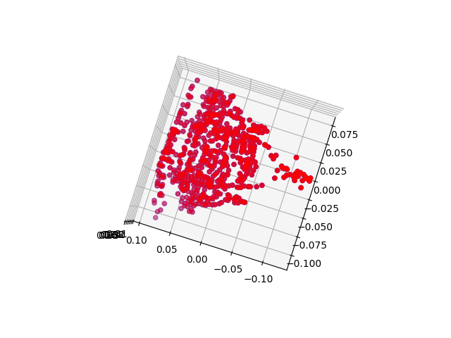
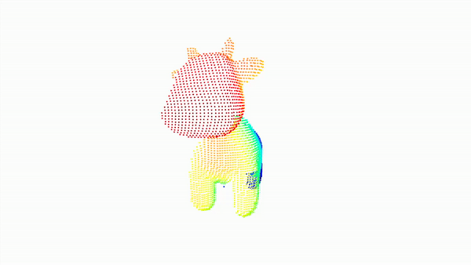
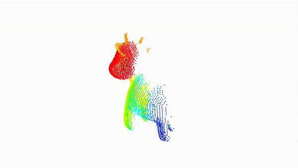
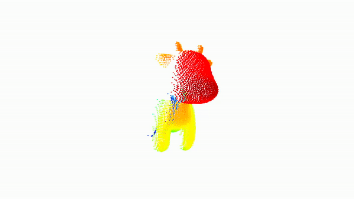
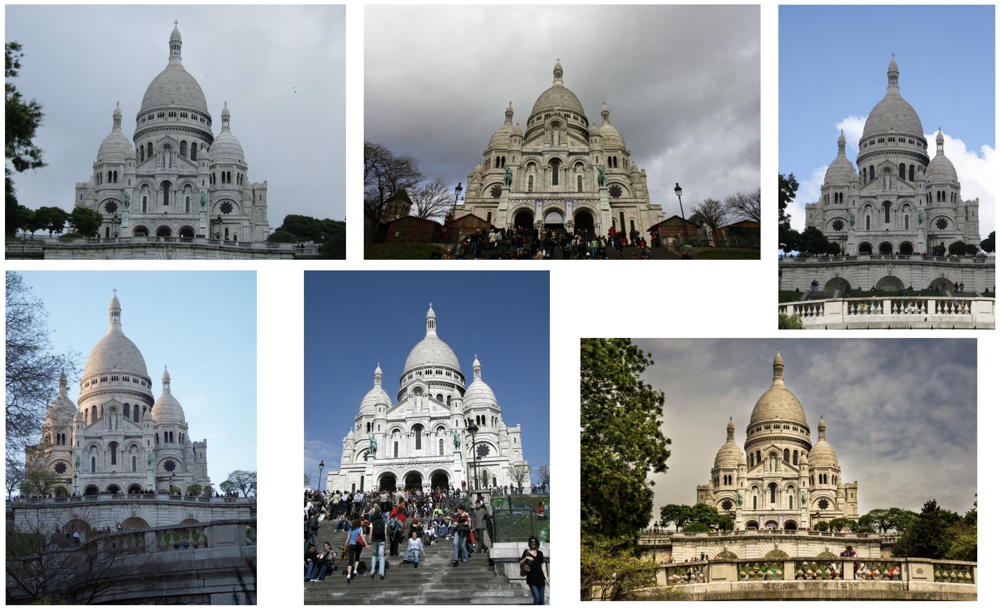
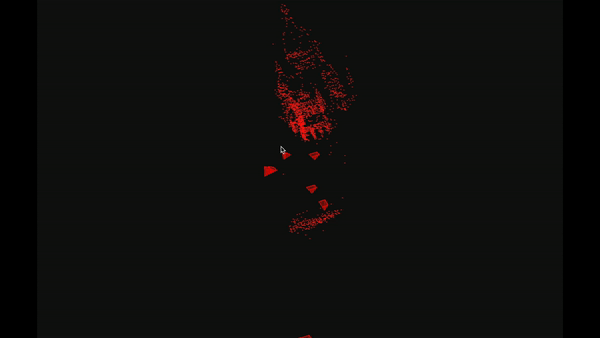

# HW4: Structure from Motion

## Instructions
* Late Submission Policy: See the late submission policy [here](https://geometric3d.github.io/pages/assignments/hw0.html).
* Submitting your work: Check the instructions for submission [here](https://geometric3d.github.io/pages/assignments/hw0.html).

## Overview

You will implement an entire incremental Structure-from-Motion (SfM) pipeline in this assignment. You will start by implementing an initialization technique for your incremental SfM. Next, given known intrinsics and extrinsics you will implement the incremental SfM over the given 4 images. Finally, utilizing the off-the-shelf tools such as COLMAP on your own sequences and generate the reconstructions.

## Q1: Baseline Reconstruction (20 points)
Your goal in this question is to implement initialization for incremental SfM, i.e., reconstruction on two views. 

**Dataset**
- Run your code on the two "real world" images in `data/monument` folder, which also contains "noisy" keypoint matches.

**Submission**
- Visualization of the 3D reconstruction from at least two views. Example of the visualization:

    | View #1 | View #2 |
    | -----------  | ----------|
    |    |  |
    
- Report the extrinsics `R` and `t` of view 2 (which corresponds to `data/monument/img2.jpg`.

- Brief description of your implementation (i.e., the algorithm followed with relevant equations).

## Q2: Incremental Structure-from-Motion (40 points)

Here, you will implement incremental Structure-from-Motion (SfM). You will implement incremental SfM using four synthetic images. We provide "clean" 2D keypoint correspondences across all pairs of these images in the folder `data/data_cow/correspondences/`. Starting from 2 images (whose extrinsincs are provided) and assuming that the intrinsics remain fixed for all the four images, you will incrementally add each of the other 2 images. 

**Dataset**
> Images: `data/data_cow/images`
> Correspondences (all pairs): `data/data_cow/correspondences`
> Cameras: `data/data_cow/cameras`

- Run your code on the four images of synthetic cow in `data/data_cow` folder, which also contains all pair correspondences between 4 images. Please start (initialize) your incremental SfM using `Camera 1` and `Camera 2`. You can assume fixed intrinsics for all the 4 images.

**Submission**
- After each addition of images, your 3D reconstruction from incremental SfM should look something like as shown below. You need to submit your visualization of the 3D reconstructions at each of the following stages. 

    Using Camera #1 and #2 | After adding Camera #3  | After adding Camera #4 |
    | -----------  | ----------| ---------- |
    |  |  |  | 

    
- Report the extrinsics `R` and `t` of Camera #3 and Camera #4. 

- Brief description of your implementation.

## Q3: Reconstruct your own scene! (40 points)
For this part, you will run an off-the-shelf incremental SfM toolbox such as [COLMAP](https://github.com/colmap/pycolmap) on your own captured multi-view images. Please submit a gif of the reconstructed 3d structure and the location of cameras.

### (A) Generate reconstructions (20 points)
For this reconstruction, you can choose your own data. This data could either be a sequence having rigid objects, any object (for e.g. a mug or a vase in your vicinity), or any scene you wish to reconstruct in 3D.

**Submissions**
-  Multi-view input images.
-  A gif to visualize the reconstruction of the scene and location of cameras (extrinsics).
-  Run this on at least 2 sequences / objects / scenes

  | Example Multi-view images  | Output | 
  | ----------- | ----------- | 
  |    |  |  

### (B) Stress test the hyperparameters of COLMAP (20 points)
For this part, we want you to `stress test` or play with hyper-parameters in the COLMAP system. We want you to pick `2` interesting questions concerning this toolbox and for each of the question, we want you to provide a brief explanation with supporting qualitative or quantitative evidence. Some example question suggestions are:

-  What happens if we reduce number of input images?
-  Under what scenario and conditions does the reconstruction pipeline breaks?
-  What happens if we play with some tolerance parameters?

Above mentioned are just suggestions for you to play around the toolbox. Feel free to try anything you think could be interesting, and report back the findings.

**Submissions**
-  `2` questions and supporting explanations.

## What you can *not* do
* Download any code.
* Use any predefined routines except linear algebra functions, image interpolation, and image warping.
  
## Tips
* As always, it is a good idea to `assert` with sanity checks regularly during debugging.
* **Start Early and Have Fun!**

