# Structure from Motion

## Overview

We will implement an entire incremental Structure-from-Motion (SfM) pipeline. We will start by implementing an initialization 
technique for incremental SfM. Next, given known intrinsics and extrinsics we will implement the incremental SfM over the given 4 images. 
Finally, utilizing the off-the-shelf tools such as COLMAP on our own sequences and generate the reconstructions.

## Baseline Reconstruction
Implementing initialization for incremental SfM, i.e., reconstruction on two views. 

### Dataset
- Two "real world" images in `data/monument` folder, which also contains "noisy" keypoint matches.

### Visualization of Reconstruction

|View #1                          | View #2 |
| ----------------------------------| -----------  |
| 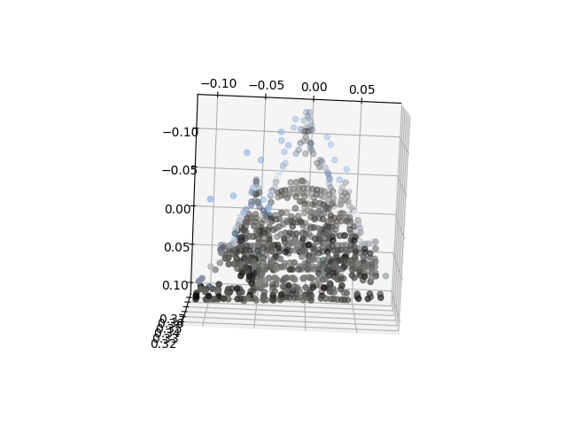 | 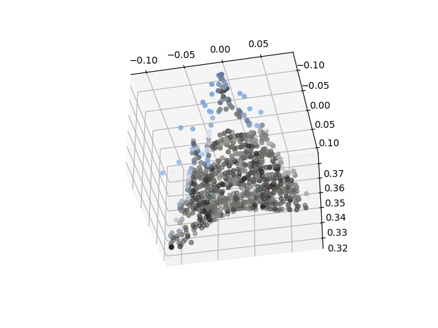 |

### Extrinsics `R` and `t` of view 2

>Rotation:
`[[-0.99120836, -0.00829782, -0.13204971]  
 [-0.07078976, -0.80991137,  0.58226487]  
 [-0.11178009,  0.58649358,  0.80220352]]` 

>Translation:
`[-0.00779614, -0.18063356, -1.        ]`

### Implementation
Implementation:

1. Use the eight point algorithm to estimate the fundamental matrix F. The correspondences can be noisy. Hence, use RANSAC.
2. Compute Essential matrix using $E = K_2^T F K_1$. Set the first two singular values to be equal to the mean of first two 
   singular values and the third one to be 0. This will singularize E.
3. Initialize the first camera to be at world centre and aligned.
4. Decompose the E to find 4 possible extrisincs as `[U W V^T | u_3], [U W V^T | -u_3], [U W^T V^T | u_3], [U W^T V^T | -u_3]` where `W = [0, -1, 0], [1, 0, 0], [0, 0, 1]`
5. Choose the matrix for which all points lie in front of both cameras. Equivalently, you can find the camera that minimizes reprojection loss. 
6. Use the obtained camera matrix to triangulate and get 3D points.

## Incremental Structure-from-Motion

Incremental sfM for 4 images. "clean" 2D keypoint correspondences across all pairs of these images are in the folder 
`data/data_cow/correspondences/`. 
Starting from 2 images (whose extrinsincs are provided) and assuming that the intrinsics remain fixed for all the four images, we will 
incrementally add each of the other 2 images. 

### Dataset
> Images: `data/data_cow/images`
> Correspondences (all pairs): `data/data_cow/correspondences`
> Cameras: `data/data_cow/cameras`

### Visualization of reconstruction

 Using Camera #1 and #2                                   | After adding Camera #3                                     | After adding Camera #4                                       |
|----------------------------------------------------------|------------------------------------------------------------|--------------------------------------------------------------|
| 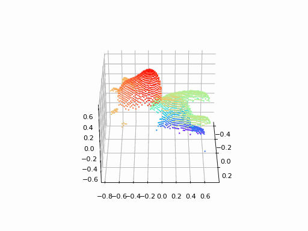 | 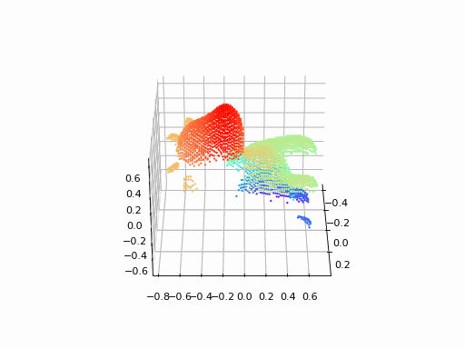 | 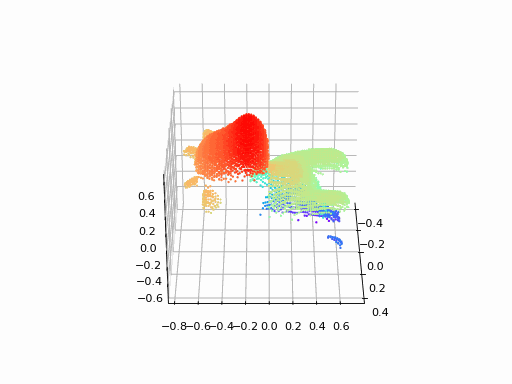 | 

    
### Extrinsics `R` and `t` of Camera #3 and Camera #4. 

| Camera #3                                                                                                                                                                                          | Camera #4                                                                                                                                                                                        |
|----------------------------------------------------------------------------------------------------------------------------------------------------------------------------------------------------|--------------------------------------------------------------------------------------------------------------------------------------------------------------------------------------------------| 
| `Rotation :[[ 0.98466192  0.00646281  0.17435346] [-0.00986351  0.99977751  0.0186452 ] [-0.17419416 -0.02007895  0.98450659]]`, `Translation: [-3.01585037e-03, -6.43987804e-03, 9.97564903e+00]` | `Rotation :[[ 0.99030413  0.0111717  -0.13846633][-0.00780679  0.99966144  0.02482063][ 0.13869674 -0.023499    0.99005607]]` , `Translation [-5.82749044e-04, -5.34493938e-03, 9.99912505e+00]` | 

### Implementation

1. Triangulate between 2D correspondences of image 1 and 2 (known to be exact) using the camera matrices of camera 1 and 2. Thi will give the first 
   set of 3D points.
2. Find 2D points in image 3 corresponding to 2D points in image 1 and image 2. These are the points in image 3 for which 3D points are now 
   available.
3. Use newly obtained 2D-3D correspondences for camera 3 to solve for pose estimation problem. This gives the extrinsics of camera 3.
4. Triangulate between points correspondences between images 1 and 3 and images 2 and 3 to obtain new set of 3D points.
5. Repeat steps 2 through 4 for to find extrinsics of camera 4 and add new points. Include correspondences from images 1, 2 and 3.

## Reconstruct your own scene!
For this part, we will run an off-the-shelf incremental SfM toolbox such as [COLMAP](https://github.com/colmap/pycolmap) and [COLMAP GUI](https://github.com/colmap/colmap/releases/tag/3.5) on our own 
captured 
multi-view images. 

### Generate reconstructions 
For this reconstruction, we choose our own data. This data could either be a sequence having rigid objects, any object (for e.g. a mug or a vase 
in your vicinity), or any scene we wish to reconstruct in 3D.

#### Datasets:  
1. [bunny](https://vision.in.tum.de/old/data/bunny_data.tar.gz) (36 views)  
2. [sacre_coeur](https://www.cs.ubc.ca/research/image-matching-challenge/2021/data/) (100 views)

| Example Multi-view images  -- bunny                                                                                                                                                                           | Output                                | 
|-----------------------------------------------------------------------------------------------------------------------------------------------------------------------------------------------------------|---------------------------------------| 
| 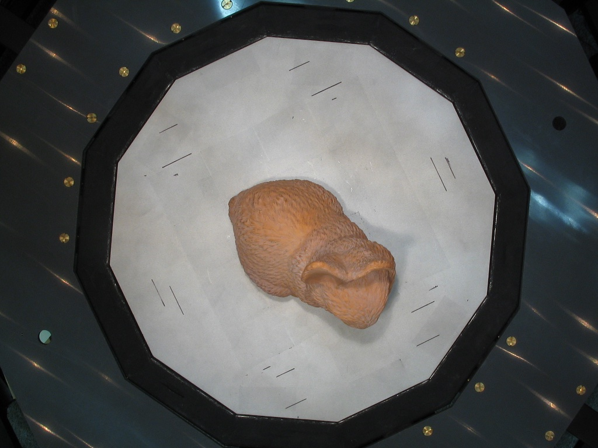 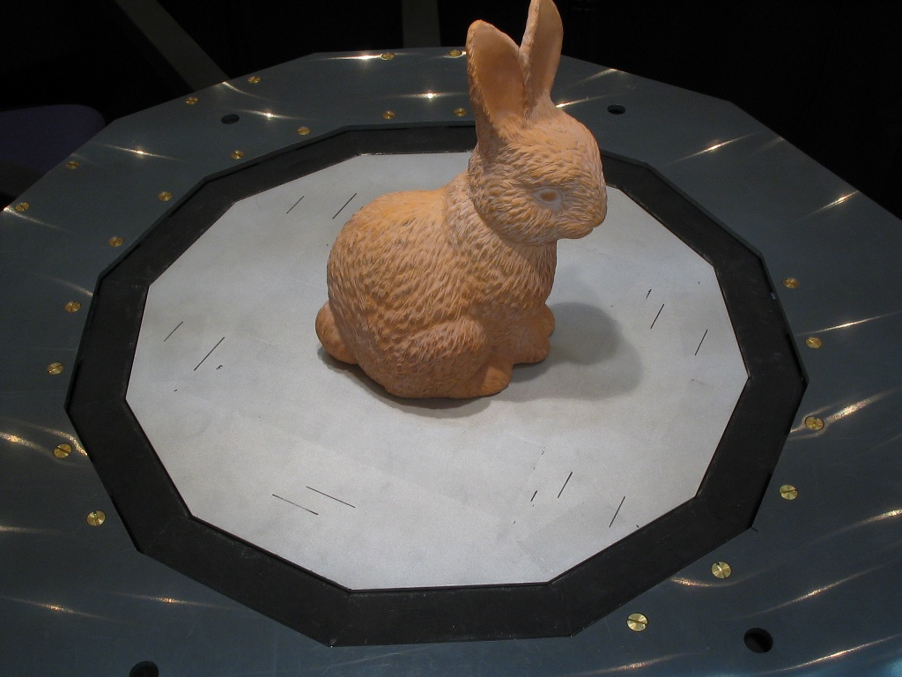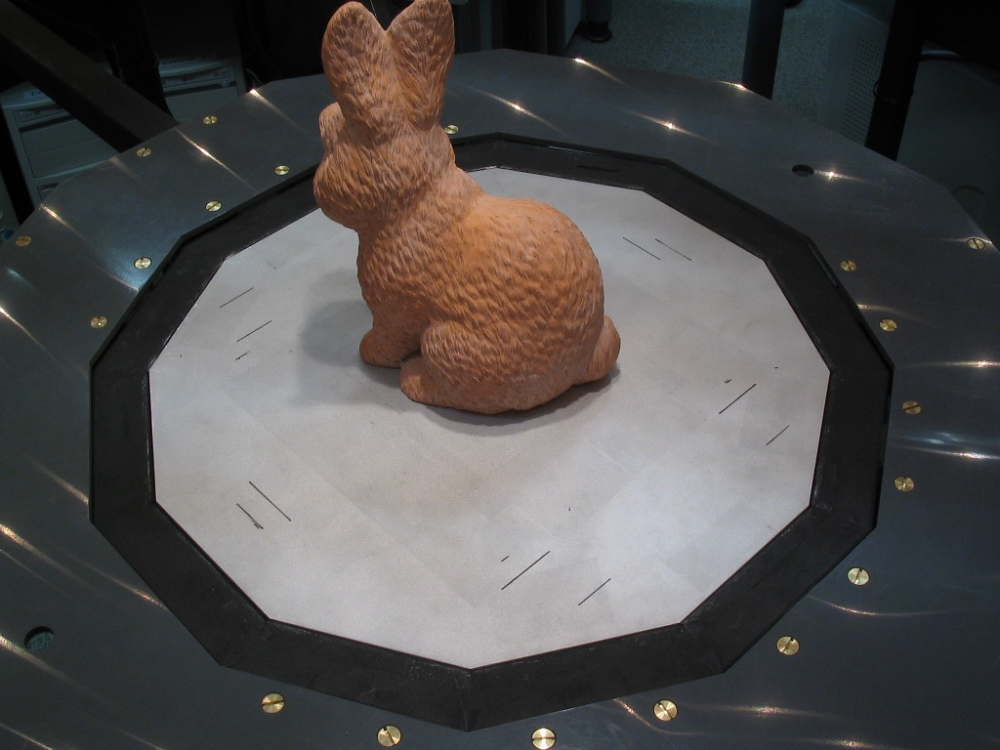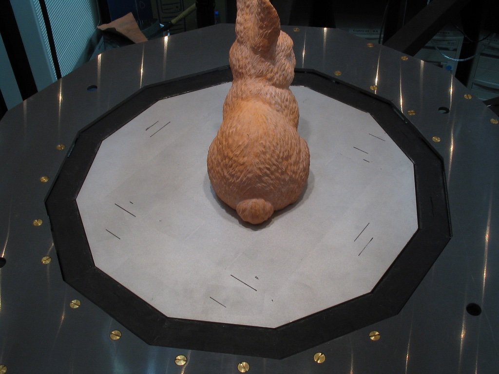 | 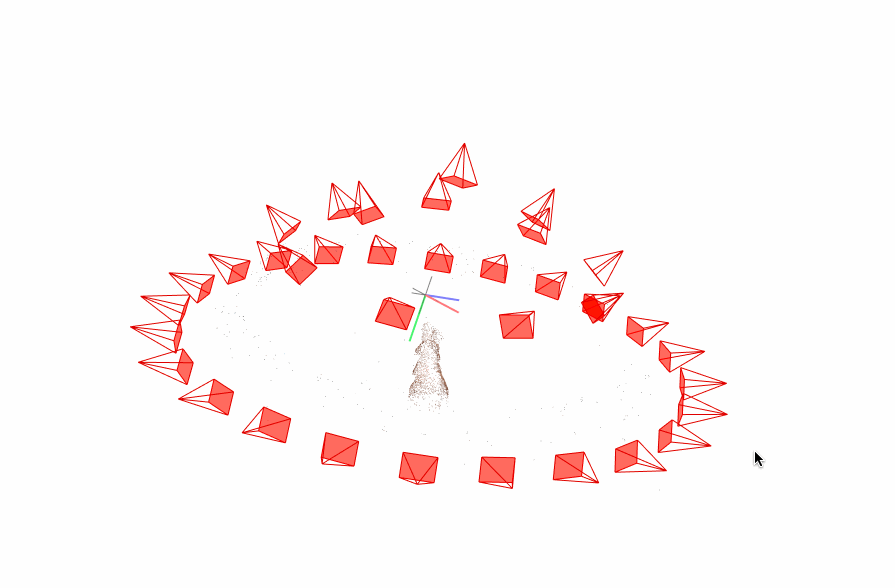 |  

| Example Multi-view images -- sacre_coeur                                                                                                                                                                                                 | Output                                      | 
|--------------------------------------------------------------------------------------------------------------------------------------------------------------------------------------------------------------------------------------|---------------------------------------------| 
| 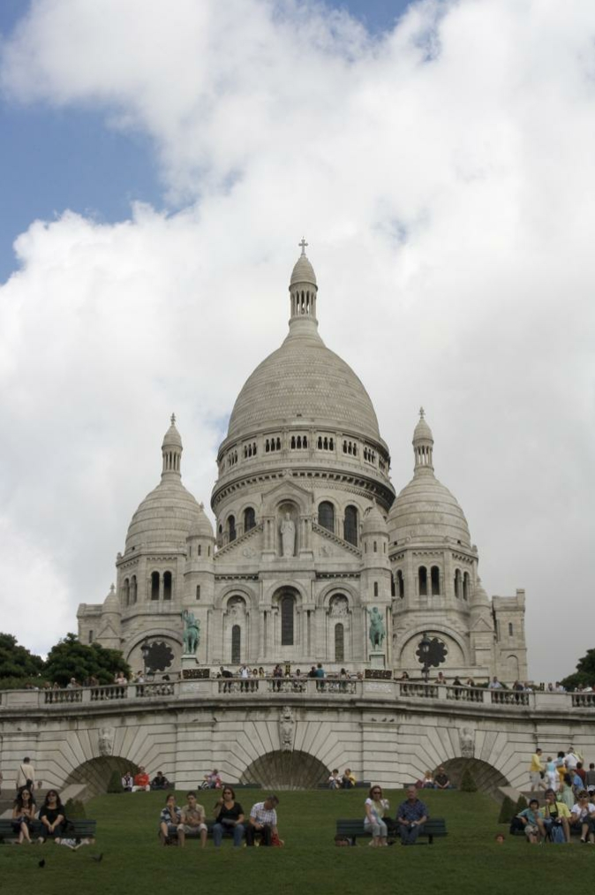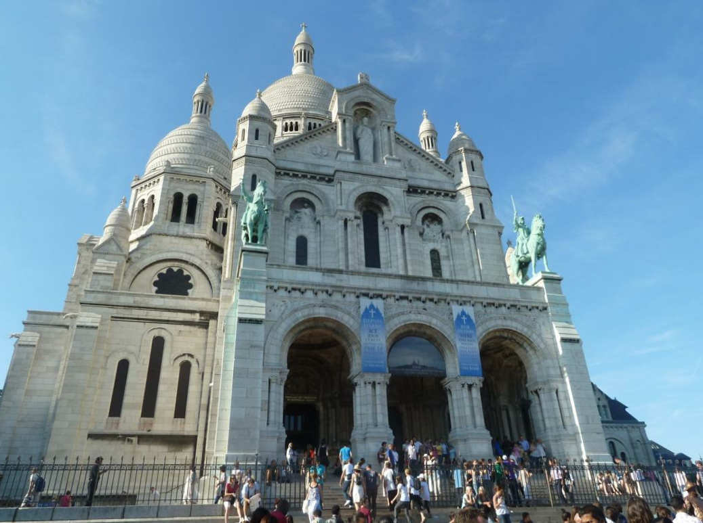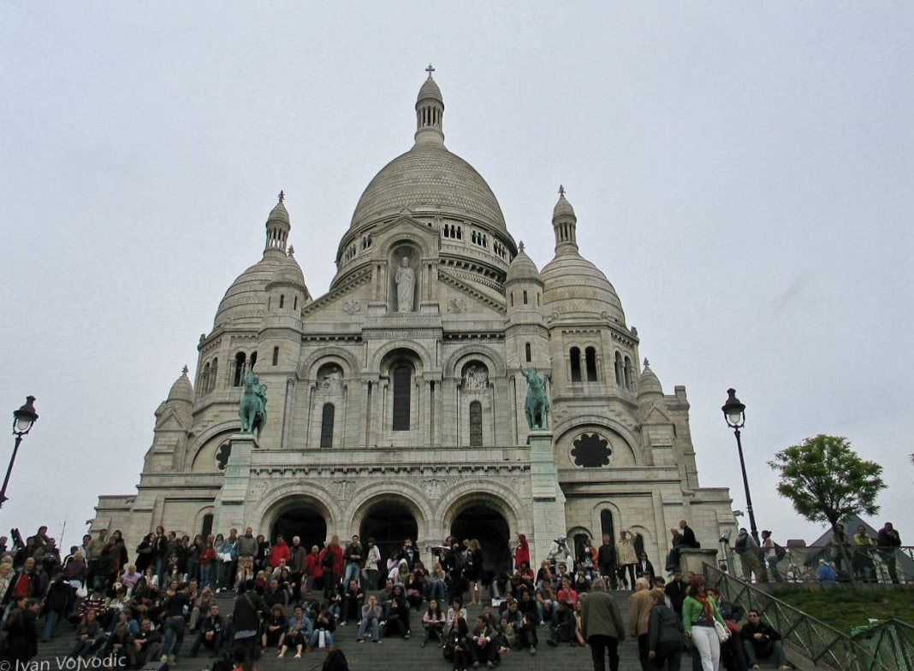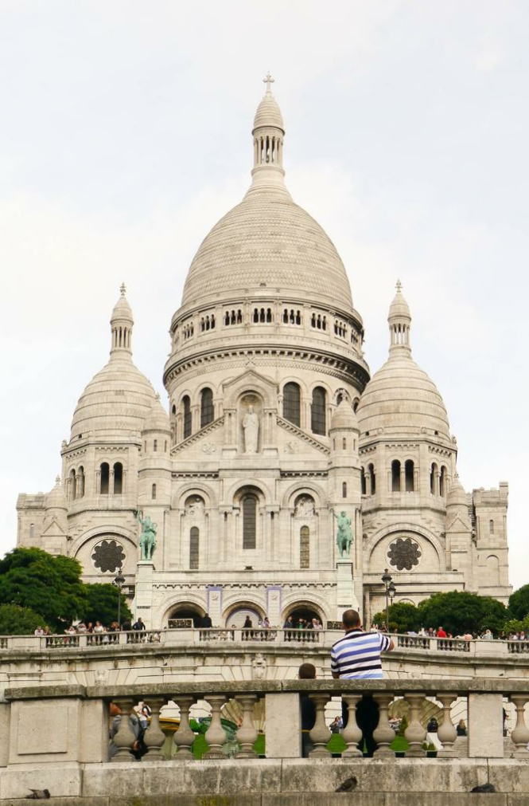 | 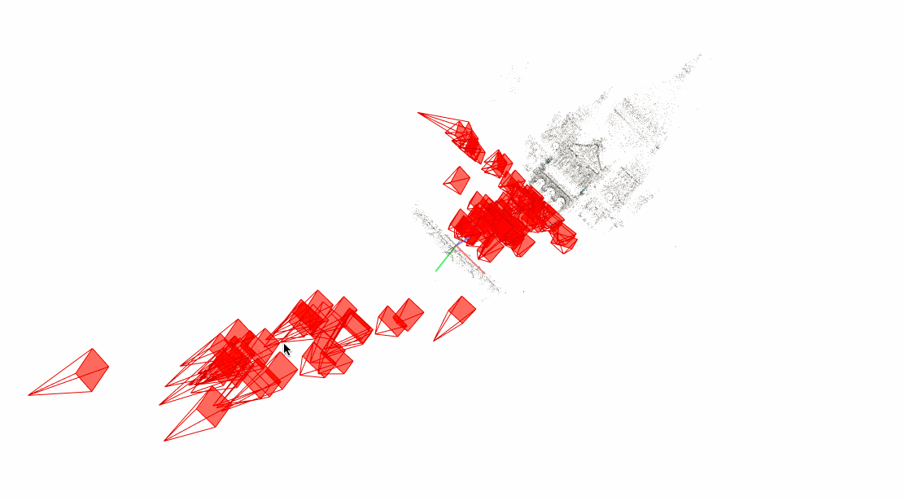 |  

### Stress testing hyperparameters of COLMAP

#### What happens if we reduce number of input images?

When we reduce the number of images such that the overlap between the views reduces, the reconstruction starts to fail. This happens because 
the feature extraction cannot find matching features between views and therefore the downstream pipeline breaks. Here we show results with 
varying number of views on the [bunny](https://vision.in.tum.de/old/data/bunny_data.tar.gz) dataset. With 4 and 9 views the reconstruction fails entirely. With 18 views, (i) only the cameras with 
sufficient overlap are reconstructed, (ii) the reconstruction is sparse and (iii) the cameras are estimated with poor accuracy
With 36, views the reconstructions seems to be accurate with all cameras predicted with high accuracy.

| Number of views               | Output                                           | 
|-------------------------------|--------------------------------------------------| 
| 4                             | Failed with `No good initial image pair found.`  |
| 9                             | Failed with `No good initial image pair found.`  |
| 18  (large overlap b/w views) | 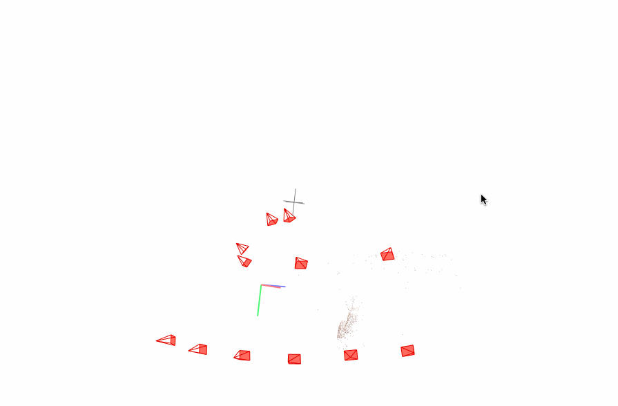         |
| 18  (small overlap b/w views)     | 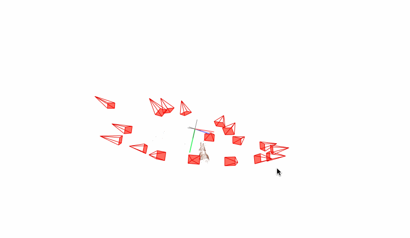 |
| 36                            |             |

#### When does the reconstruction pipeline breaks?

The pipelines breaks with insufficient views with little to no overlap as shown in above. Here, we also test how COLMAP performs when the input 
views are texture-less. In such cases, feature matching fails  feature matches. As tested on the `paper roll` dataset, the 
reconstruction fails to reconstruct the paper roll and or the cameras accurately. The reconstructed points are very sparse with no shape. The paper 
roll has a flat texture and the floor has repeating patterns. Therefore, COLMAP is sensitive to the texture of the input views. 

| Example Multi-view images                                                                                                                                                                                                       | Output                                  | 
|---------------------------------------------------------------------------------------------------------------------------------------------------------------------------------------------------------------------------------|-----------------------------------------| 
| 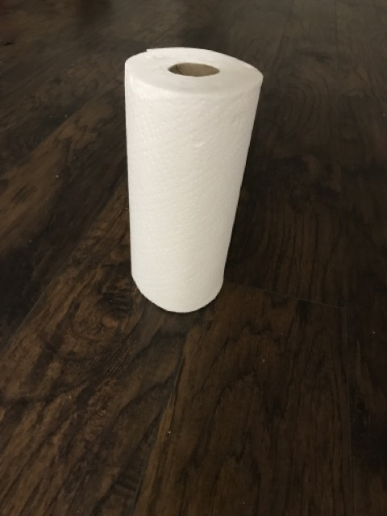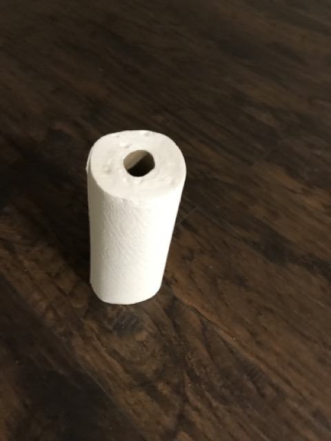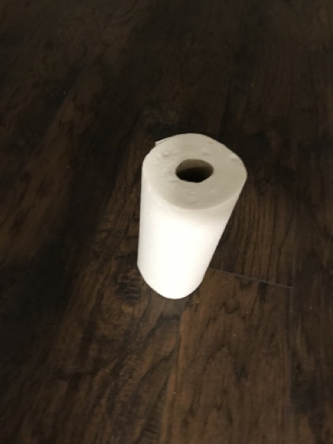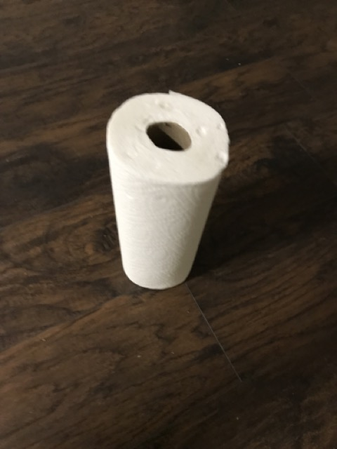 | 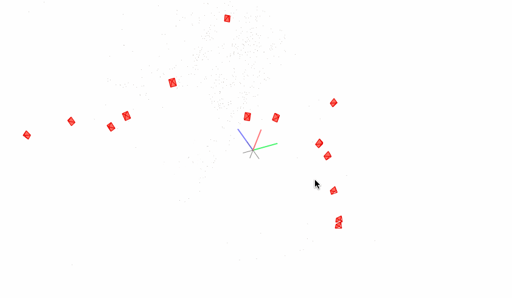 |  

